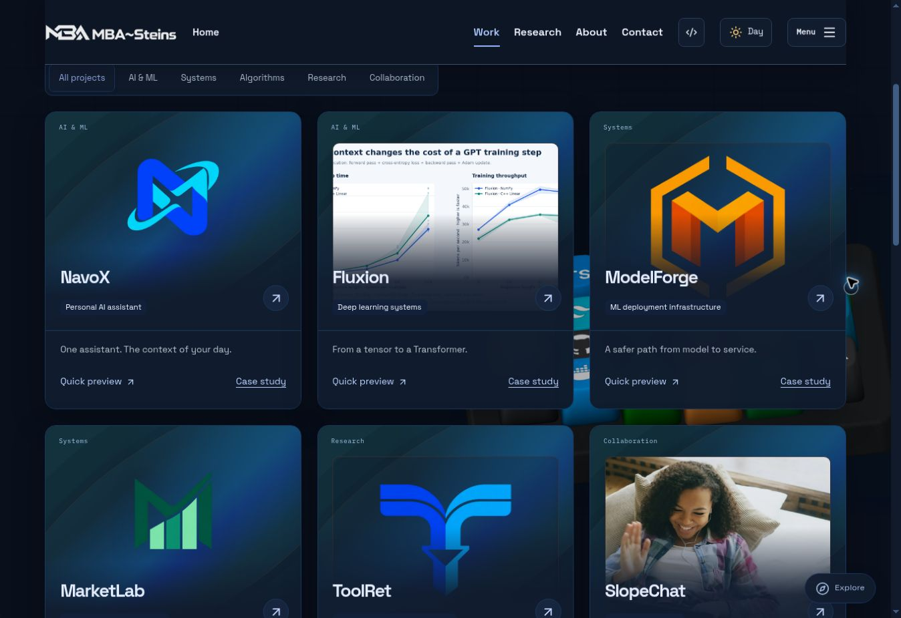

# Michael Baffour Awuah — My Portfolio

The source for [michaelbaffourawuah.com](https://michaelbaffourawuah.com), my personal portfolio of software, AI systems, research, and life at Cornell.



## Explore

- **Work:** NavoX, Fluxion, ModelForge, MarketLab, ToolRet, SlopeChat, and Pro Competitive Programming.
- **Case studies:** project overviews, system explanations, evidence, source code, and supporting documents. Section tabs also navigate a continuous scrolling page.
- **Research:** my ToolRet retrieval study and earlier engineering work.
- **My Story:** Electrical & Computer Engineering at Cornell, AFROTC, Cornell Bowers, and MBA~Steins.
- **Contact:** an email-draft form, GitHub, and LinkedIn.

The interface includes a shared Spline keyboard scene, animated project cards, media galleries, and day/night themes. New visits start in night mode. Reduced-motion and unavailable-WebGL fallbacks are included.

## Run locally

Use Node.js **22.13 or later** and the repository's pinned **pnpm 11.25.0**.

```bash
pnpm install --frozen-lockfile
pnpm dev
```

Open the local address printed by the server (normally `http://localhost:5173`). A clean checkout uses the portable execution profile automatically. No API keys are required to browse the portfolio or open the contact email draft.

```bash
# Check TypeScript
pnpm exec tsc --noEmit --incremental false

# Create the production Worker build
pnpm build

# Preview that build locally
pnpm start
```

## Built with

React, TypeScript, Vinext/Vite, Tailwind CSS, Motion, GSAP, Lenis, Spline, and Cloudflare Workers. Dependencies and versions are recorded in `package.json` and `pnpm-lock.yaml`.

## Source layout

| Path | Contents |
| --- | --- |
| `app/` | Pages, routes, and styles |
| `components/` | Navigation, project explorer, 3D scene, galleries, and interface components |
| `lib/` | Project descriptions, research content, technology data, and shared logic |
| `public/` | Project logos, photographs, videos, fonts, documents, and scene assets |
| `build/` | Worker and build integration |
| `scripts/` | Development and build helpers |
| `docs/` | Visual references and interaction-source credits |

## Updating the portfolio

See the [content maintenance guide](docs/CONTENT-GUIDE.md) for the files behind project cards, case studies, personal photos, social links, and page metadata, plus the checks to make before publishing an update.

## Hosting and assets

The live portfolio is published through Sites at [michaelbaffourawuah.com](https://michaelbaffourawuah.com). This repository contains its source; production builds target Cloudflare Workers.

Project evidence links and measurement scope are retained alongside each case study. NavoX demo media uses sample data. Asset credits and font/icon licenses are included in `docs/INTERACTION-SOURCE.md`, `lib/technology-assets.json`, and their corresponding `public/` folders.
